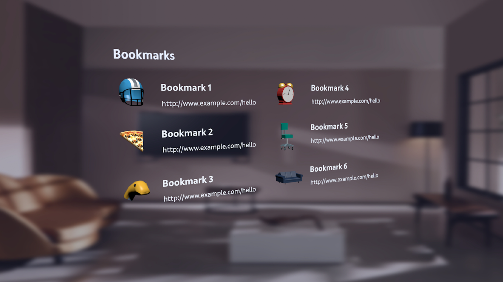
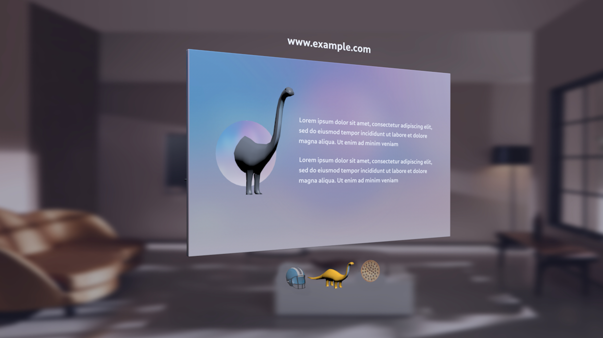

# Why Spatial Favicons ?

Traditionally favicons are flat 2D images. With immersive-web as experiences transition to 3D/spatial it is apt that the favicons too become 3D/spatial.

## What usecases ?

A favicon provides a quick visual representation of the web page/site and is used by user agents across many use cases. Here is a non-exhaustive list of use cases:

- Identify a tab in multi-tab browser / Address bar.
- As a bookmark or shortcut on platform.
- An entry in history.

## About Specifications:

### Current Specification

* A __link__ element with ‘icon’ keyword is used to represent a page or site favicon (HTML Spec [4.6.6.8](https://html.spec.whatwg.org/multipage/links.html#rel-icon)).
* The ‘sizes’ attribute indicate width and height of the icon in terms of raw pixels.
* The ‘type’ attribute indicate the mime type of the icon.
* The ‘rel’ attribute is either ‘icon’ or ‘shortcut icon’.
* User agents support many image formats: ICO, PNG, SVG, JPEG, APNG etc.
* [WebApp manifest](https://www.w3.org/TR/appmanifest/#icons-member) uses 'icons' member to specify one or more icons associated with the WebApp.

### Proposal

* Continue to use __link__ element with rel 'icon' for representing a spatial favicon.
* Use Khronos [glTF (v2.0)](https://github.com/KhronosGroup/glTF/blob/master/specification/2.0/README.md) binary (.glb) as the 3D asset format.
* The 'type' attribute should be glTF binary mime : **model/gltf-binary**
* The 'sizes' attribute should be extended with an additional dimension: 'depth'. User agents should interpret sizes as : 'width' x 'height' x 'depth'. This will follow the same parsing rules for non negative integers as specified in section [4.6.6.8](https://html.spec.whatwg.org/multipage/links.html#rel-icon) of the specification.
* The 'sizes' will now indicate the asset size in **millimeters**.
* The WebApp manifest 'icons' member should be extended to incorporate 3D/spatial icons and the 'sizes' member will also have a third dimension: 'depth' when associated with spatial icons. When multiple icons are provided user agents would select a spatial icon for immersive mode if it supports else continue to follow existing alogorithm to choose a 2D icon from the 'icons' array.


### Additional Notes

* 'depth' is not a defined CSS property.

## Constraints:

### Why Constraints ?

To achieve consistent experiences accross many XR devices, spatial icons should have some binding constraints. XR devices range from a mobile phone to desktop driven headsets with a wide gap in their capabilites (Power, Performance, CPU, GPU). Hence the need to have a common denominator.

```
IMPORTANT: These contraints may change. As devices get more powerful,
more richly featured (Animations, Level Of Detail (LOD)) favicons could be supported.
```

### Baseline Guidance:

* The glTF binary asset should be a self contained asset with all the necessary data (Geometry and Textures) baked into the binary. If the binary refers to any external resources user agents can choose to ignore the referred external resource or may deem the asset as invalid for spatial icon.
* Animations will not be supported, if animations are specificed user agents will ignore and render the asset in the bind pose.
* Multiple spatial icons can be specified and user agents may choose an appropriate one for the use case.
* Textures should be prepared using PBR metallic Roughness workflow.
* Multi UVs will not be supported.
* Double sided materials are not supported.

### Good Practice:

The following guidance is provided to ensure a good responsive experience with spatial icons.

* Favicons are typically small (in KBs), 3D assets can be order of magnitude larger (typically many MBs). Prefer < 1 MB in size.
* Limit the Polygon count to < 10,000. Example: If an user agent uses spatial icons for listing bookmarks and there are hundreds of bookmarks displayed in the view, complex and high poly icons may slow down loading and scrolling of bookmarks.
* The assets should be centered around the scene origin : (0,0,0). Example: If the asset is a sphere, the center of the sphere should be at (0,0,0). If an user agent wants to align spatial icons, it may need to do additional translations and may scale down the icons for alignment purposes.
* Limit number of nodes to < 64.
* Recommended texture sizes to be within 1024 x 1024.

## Multiple Icons

Per specifications authors can provide multiple favicons (or WebApp icons). These icons can be high quality (high polygon count, larger textures, very fine details etc) and low quality (low polygon count, small texture, less details) versions of the same asset, or could be completely different assets. User agent has the freedom to choose any one icon to represent the page or the WebApp. The choice can be based on the 'sizes' attribute. User agent or the the platform is also free to use different icons for different use cases.

### Example 1: High Quality and Low Quality versions of the same asset

A desktop icon like shortcut to a website on the platform could use a high quality version of the icon. While the same platform's user agent could use a low quality icon to represent the website in a bookmark listing. See sample renderings below.

### Example 2: High Quality asset different from Low Quality asset

A website or WebApp represented by a Dinosaur 3D icon can provide two 3D icons. A high quality one with a complete Dinosaur and a low quality Dinosaur head only asset. A multi tab user agent can show the entire Dinosaur asset for an Active Tab, but show only the head asset in the list of bookmarks. See sample renderings below.

### Sample Rendering of Spatial Icon use cases

#### Sample 1: User Agent bookmark listing



#### Sample 2: User Agent multi tab browsing




